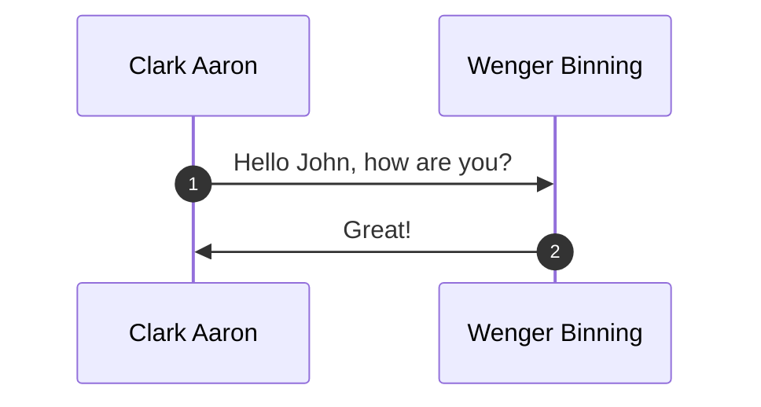
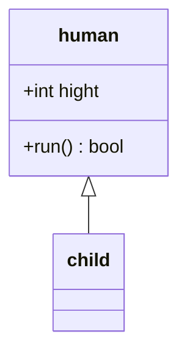

# mermaid

[//]: # (__author__ = "Wenger Binning")

<!-- https://mermaid-js.github.io/-->

mermaid是基于Javascript的工具，使用标记的语法来呈现可定制的图表。

## 图标样式

### 图表

图标通常以`graph`标识，流程图是以`flowchart`标识，两者具有同样的语法结构，但是flowchart具有更多箭头类型、多向箭头、子图之间的连接。

* 流程图的方向控制：

  * 从上至下的顺序：

    ```mermaid
    graph TB
    A(开始) --> B(结束)
    ```

  * 从下至上的顺序：

    ```mermaid
    graph BT
    A(开始) --> B(结束)
    ```

  * 从右至左的顺序：

    ```mermaid
    graph RL
    A(开始) --> B(结束)
    ```

  * 从左至右的顺序：

    ```mermaid
    graph LR
    A(开始) --> B(结束)
    ```

* 结点的样式：结点一般是以`<node ID>`标识的。

  * 矩形外框的结点：

    ```mermaid
    graph LR
    A[开始] --> B[结束]
    ```

  * 小圆角外框的结点：

    ```mermaid
    graph LR
    A(开始) --> B(结束)
    ```

  * 大圆角外框的结点：

    ```mermaid
    graph LR
    A([开始]) --> B([结束])
    ```

  * 子例程外框的结点：

      ```mermaid
      graph LR
      A[[开始]] --> B[[结束]]
      ```

  * 圆柱形外框的结点：

      ```mermaid
      graph LR
      A[(开始)] --> B[(结束)]
      ```
  
  * 圆形外框的结点：

    ```mermaid
    graph LR
    A((开始)) --> B((结束))
    ```

  * 其他形状外框的结点：

    ```mermaid
    graph LR
    A>开始] --> B{{步骤1}} --> C[\步骤2\] --> D[/步骤3/] --> E[/步骤4\] --> F[\步骤5/] --> G{结束}
    ```
  
* 连线的样式：

  * 普通实线:

    ```mermaid
    graph LR
    A>开始] --- B{{步骤1}} --过渡--- C[\步骤2\] ---|过渡| D[/步骤3/] --> E[/步骤4\] --过渡--> F[\步骤5/] -->|过度| G{结束}
    ```
  
  * 普通虚线：

    ```mermaid
    graph LR
    A>开始] -.- B{{步骤1}} -.过渡.- C[\步骤2\] -.-|过渡| D[/步骤3/] -.-> E[/步骤4\] -.过渡.-> F[\步骤5/] -.->|过度| G{结束}
    ```

  * 加粗实线：

    ```mermaid
    graph LR
    A>开始] === B{{步骤1}} ==过渡=== C[\步骤2\] ===|过渡| D[/步骤3/] ==> E[/步骤4\] ==过渡==> F[\步骤5/] ==>|过度| G{结束}
    ```
  
  * floatchat支持的特殊连线：

    ```mermaid
    flowchart LR
    A --o B --x C o--o D x--x E --> F <--> G
    ```
  
  * 特殊的连线方式：

    ```mermaid
    graph LR
    A --- B & C --- D
    %%E & F --- G & H
    ```

* 子图：

  * 一般子图的应用：

    ```mermaid
    graph LR
    A --- B
    subgraph top[开始]
        A
    end
    subgraph tail[结束]
        B
    end
    ```
  
  * floatchat支持的子图：

    ```mermaid
    flowchart LR
    subgraph top[开始]
        A
    end
    subgraph tail[结束]
        B
    end
    top --- tail
    ```

* 外部链接：这个功能当使用`securityLevel='strict'`时关闭，使用`securityLevel='loose'`启用。

  ```mermaid
  graph LR
  A[开始] --- B[结束]
  click A https://github.com "GitHub url."
  ```

* 样式：

  * 链接样式：

  * 结点样式：

    ```mermaid
    graph LR
    A(开始) --- B(结束)
    style A fill:#bbf,stroke:#f66,stroke-width:2px,color:#fff,stroke-dasharray: 5 5
    style B fill:#f9f,stroke:#333,stroke-width:4px
    ```

### 时序图

时序图以`sequenceDiagram`标识的图形。



* 参与者：使用`participant`标识参与者并设定别名。

  ```mermaid
  sequenceDiagram
    participant Clark as Clark Aaron
    participant Wenger as Wenger Binning
    participant jianghu as Jianghu Studio
  ```

* 消息：使用`<发送者><arrow><接收者>：<message>`。

  ```mermaid
  sequenceDiagram
    participant Clark as Clark Aaron
    participant Wenger as Wennger Binning
    Clark ->>Wenger: Hello,Wenger?
  ```

* 箭头：

  ```mermaid
  sequenceDiagram
    participant Clark as Clark Aaron
    participant Wenger as Wenger Binning
    Clark -> Wenger: Hello，I'm Clark.
    Wenger --> Clark: Hi, i'm Wenger.
    Clark ->> Wenger: How are you?
    Wenger -->> Clark: I am fine.
    Clark -x Wenger: What are you doing?
    Wenger --x Clark: I am going to interview.
  ```

* 激活函数：使用`activate`标识开始，`deactivate`标识结束。

  ```mermaid
  sequenceDiagram
   participant Clark as Clark Aaron
   participant  Wenger as Wenger Binning
   Clark ->> Wenger: Hello,wenger?
   Wenger ->> Clark: Hi,Clark.
   activate Clark
   Clark ->> Wenger: Look at  me.
   deactivate Clark
  ```

* 便签：使用`note`标识。

  ```mermaid
  sequenceDiagram
    participant Clark as Clark Aaron
    participant Wenger as Wenger Binning
    note left of Clark: Today call she.
    note over Clark,Wenger: afternoon meeting.
  ```

* 循环：

  ```mermaid
  sequenceDiagram
    participant Clark as Clark Aaron
    participant Wenger as Wenger Binning
    loop every minute check status
      Clark -> Wenger: are you finished.
    end
  ```

* 条件选择执行：

  ```mermaid
  sequenceDiagram
    participant Clark as Clark Aaron
    participant Wenger as Wenger Binning
    alt is option one
      Clark -> Wenger: openion one.
    else is option two
      Clark -> Wenger: option two.
    end
    opt other option
      Clark -> Wenger: other option.
    end
  ```

* 并行发生：

  ```mermaid
  sequenceDiagram
    participant Clark as Clark Aaron
    participant Wenger as Wenger Binning
    par call him
      Clark ->> Wenger: how are you?
    and call she
      Clark ->> Wenger: how are you?
    end
  ```

* 背景高亮：

  ```mermaid
  sequenceDiagram
  participant Clark as Clark Aaron
  participant Wenger as Wenger Binning
  rect rgb(100,100,100)
    Clark ->> Wenger: do this.
  end
  rect rgba(50,50,50,0.5)
    Wenger ->> Clark: finished.
  end
  ```

### UML



## 转义字符

| 转义字符 | 含义 |
|:---:|:---:|
| #quot; | |
| #9829; | ❤ |
